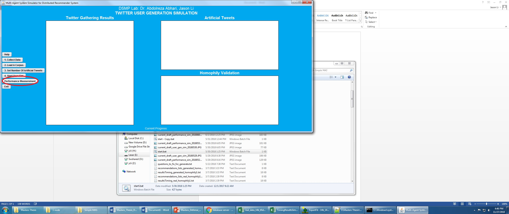
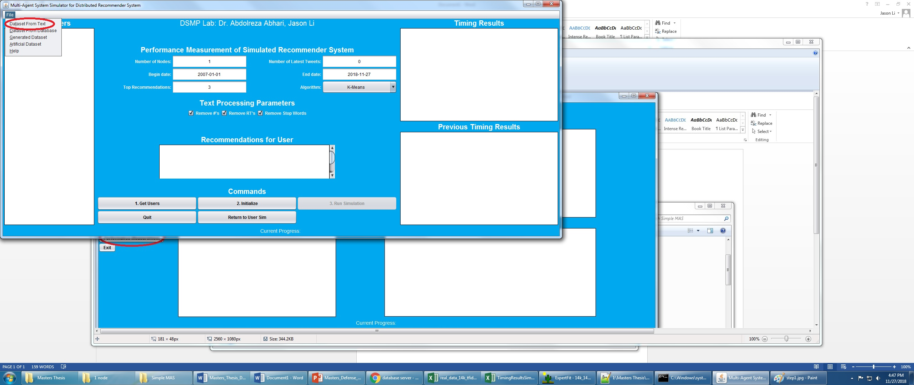
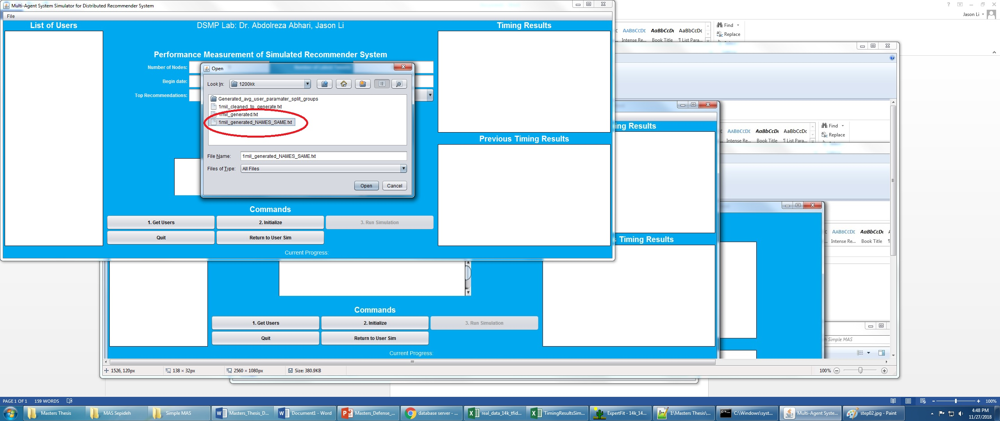
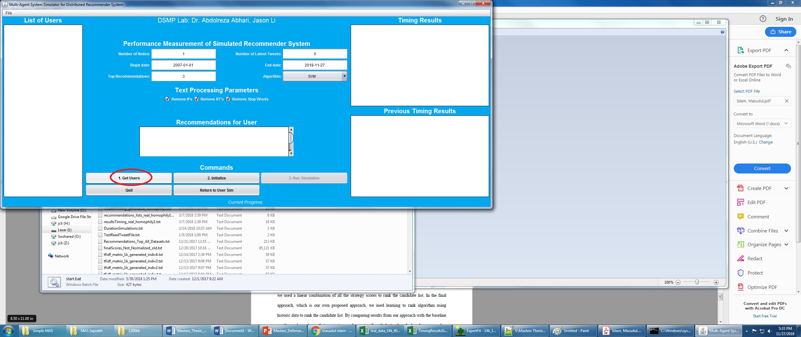
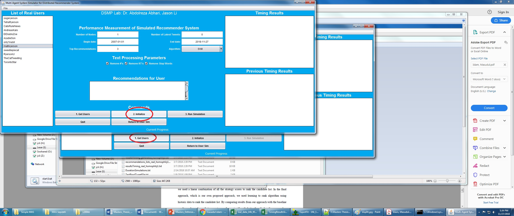
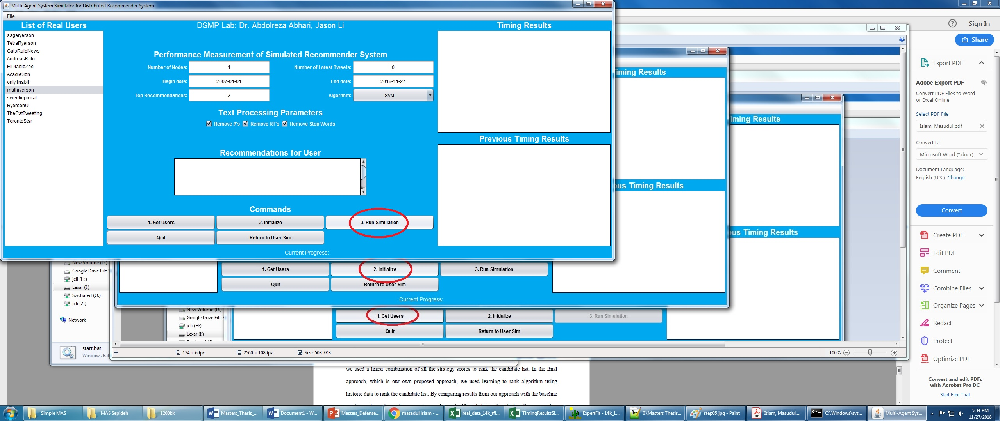
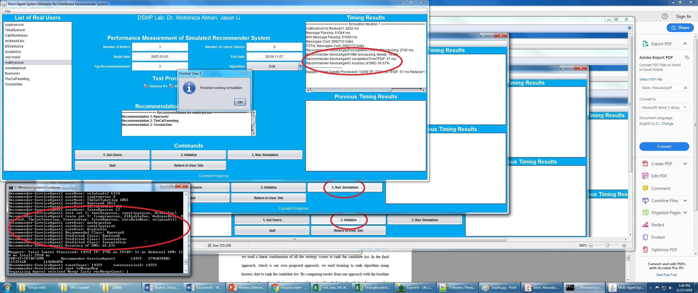

# DSMP Social Network Simulator — User Guide (v2.6)

**Document version:** Final (for testing)  
**Software:** DSMP Social Network Simulator  
**Branch / release target:** [`v2.6`](https://github.com/aabhari/SocialNetworkSimulatorV3.1/tree/v2.6)  
**Repository:** https://github.com/aabhari/SocialNetworkSimulatorV3.1  
**Lab:** DSMP Lab, Toronto Metropolitan University  
**Director:** Dr. Abdolreza Abhari  
**Prepared for:** testers and new users (including users with no prior DSMP experience)

---

## 1. What this software is

The DSMP Social Network Simulator is a Java multi-agent tool with a simple Swing UI. Researchers use it to:

1. Load a social-network style corpus (Twitter, retail, journals, or custom data converted into DSMP format)
2. Run recommendation / ML algorithms (Similarity, K-Means, SVM, **MLP**, Doc2Vec, Common-Neighbors, and others)
3. Measure accuracy and timing across one or more processing nodes

The simulator always works on one shared text format: the **Twitter follower–followee (DSMP) six-column format**. Any new dataset must be converted into that format before Performance Measurement.

---

## 2. What is new in v2.6 (read this first)

Compared with earlier builds (including the fixed Neuroph MLP on `main` / older releases), **v2.6** adds the features testers are expected to exercise:

| Area | What changed in v2.6 |
|------|----------------------|
| **Dataset Import Lab** | New GUI tool to convert raw UCI Online Retail, journals, tweets, or custom files into DSMP six-column text |
| **Class balancing** | Optional imbalance diagnosis and balancing during import |
| **MLP Settings** | Configurable hidden layers, neurons, learning rate, max error, max iterations |
| **Two MLP engines** | **Legacy Neuroph MLP** (default, same behavior as v2.5) and **Sparse Federated MLP (experimental)** |
| **MLP Auto Search** | Automatic hyperparameter search over a loaded DSMP dataset |
| **Retail / Sparse MLP fixes** | More stable training/evaluation and accuracy reporting for large sparse TF‑IDF cases |
| **Startup / import robustness** | Safer text import and compile-before-run startup scripts |

If you only need one testing priority from the lab emails: **test MLP thoroughly**, and make sure anyone can **import a new dataset into the common Twitter follower–followee format**.

---

## 3. Prerequisites

Install and put these tools on your system `PATH`:

1. **Git**
2. **Python 3.9 or 3.10** (exactly one of these; other versions are not supported by `build.py`)
3. **JDK 8 or higher** (`java` and `javac`) — JDK 8 preferred
4. **Apache Maven** (`mvn`)

Quick checks:

```bash
git --version
python3.9 --version   # or: python3.10 --version   /   py -3.9 --version
java -version
javac -version
mvn -version
```

---

## 4. Install and start the simulator

### Step 4.1 — Get the v2.6 code

```bash
git clone https://github.com/aabhari/SocialNetworkSimulatorV3.1.git
cd SocialNetworkSimulatorV3.1
git checkout v2.6
```

Confirm you are on v2.6:

```bash
git branch --show-current
# expect: v2.6
```

### Step 4.2 — First-time setup

Windows:

```bash
py -3.9 build.py setup
```

Linux / macOS:

```bash
python3.9 build.py setup
```

This creates `.venv`, installs Python packages, downloads Java libraries into `lib/`, and compiles Java sources into `classes/`.

### Step 4.3 — Run

Windows:

```bash
py -3.9 build.py run
```

Linux / macOS:

```bash
python3.9 build.py run
```

The main window title is similar to:

**Multi-Agent System Simulator for Distributed Recommender System**

There are two modes:

1. **Twitter User Generation Simulation** (opens first)
2. **Performance Measurement of Simulated Recommender System** (switch using the Performance Measurement button)

---

## 5. The DSMP data format (most important concept)

Every Performance Measurement run expects a **TAB-delimited `.txt` file with exactly 6 columns and no header row**:

```text
followee<TAB>postId<TAB>yyyy-MM-dd[ HH:mm[:ss]]<TAB>userId<TAB>userName<TAB>text
```

| Column | Name | Meaning |
|--------|------|---------|
| 1 | **followee** / reference user | Class / recommendation target (the account or category being “followed”) |
| 2 | **postId** | Numeric tweet / invoice / paper id |
| 3 | **date** | Prefer `yyyy-MM-dd`; time is optional |
| 4 | **userId** | Numeric user / customer / author id |
| 5 | **userName** | Follower / customer / author name (the entity that produced the text) |
| 6 | **text** | Tweet text, product description, paper title, etc. |

This is the **Twitter follower–followee format** used throughout DSMP. Retail and journal corpora are rewritten into this same shape so the recommender UI does not change.

### Example A — Twitter corpus (`Dataset/Reduced_14k.txt`)

```text
RyersonU	708526261514141696	2016-03-12 00:33:19	1	AHKru	release force strong captainamericacivilwar
RyersonU	708357883197595649	2016-03-11 13:24:14	1	AHKru	will watching will loving dannymcbride waltongoggins viceprincipals hbo ew ew
```

Here `AHKru` is a follower and `RyersonU` is the followee.

### Example B — Retail already converted (`Dataset/Retail.txt`)

```text
Sobeys	22153538971	2010-12-15 11:39	12865	FrankWarren	ANGEL DECORATION STARS DRESS
Sobeys	37449539330	2010-12-17 9:38	12370	JamieBranch	CERAMIC CAKE STAND HANGING CAKES
```

Here the “followee” is a store/category label (`Sobeys`, `Metro`, `Loblaws`, `Wal-Mart`) and the “follower” is a customer name. Product descriptions become the tweet text.

### Example C — Journals (`Dataset/Dataset-Journals-Authors-Titles-August6.txt`)

```text
AmericanHeartJournal	4361535	1972-12-31	67609887	OverallJamesC	intrauterine virus infections congenital heart disease
```

Here the journal/venue is the followee and the author is the user.

### Ready-to-use common corpora in the repository

Put shared experiment files under the project `Dataset/` folder (the lab’s common dataset location). Useful starter files already present:

| File | Typical use |
|------|-------------|
| `Dataset/Reduced_14k.txt` | Small Twitter smoke test |
| `Dataset/Homophily/Homophily_Set_SMALL.txt` (if present) / Homophily folders | Tiny multi-followee demos |
| `Dataset/Retail.txt` | Pre-converted UCI retail (~20k rows) for MLP/SVM |
| `Dataset/Reduced_57k.txt`, `Dataset/Reduced_94k.txt` | Larger Twitter sets |
| `Dataset/Dataset-Journals-Authors-Titles-August6.txt` | Journal recommendation experiments |
| `TestedDataset/` and `important-stuff/` | Extra copies / test splits / name–number maps |

If George or others request a large retail file (for example a 100k retail conversion), place the converted DSMP `.txt` into `Dataset/` so everyone uses the same common file.

---

## 6. Convert a new dataset into DSMP format (Dataset Import Lab)

This is the section that was missing from earlier notes. Use it whenever you have a **new** raw dataset (especially UCI Online Retail) that is not already in follower–followee format.

### Step 6.1 — Open Dataset Import Lab

1. Start the simulator (Section 4).
2. On the **User Generation** screen, click **Dataset Import Lab**.

### Step 6.2 — Choose dataset kind

| Kind | Use when |
|------|----------|
| **Retail** | UCI Online Retail / transaction exports (CSV, Excel, etc.) |
| **Journal** | Author–title–venue tables |
| **Tweets** | Twitter-like source files that still need cleaning/mapping |
| **Other** | Any delimited/workbook file; you map columns yourself |

### Step 6.3 — Select the source file and Inspect

1. Browse to your raw file (`.csv`, `.tsv`, `.xlsx`, `.xls`, `.txt`, zip workbook, etc.).
2. Click **Inspect**.
3. Confirm detected delimiter, columns, row counts, and preview look correct.

Supported delimiters are auto-detected: comma, tab, semicolon, pipe.

### Step 6.4 — Choose a mapping profile

The mapping decides what becomes the DSMP **followee** (class label).

| Profile | When to use |
|---------|-------------|
| **Similar users / entities** | One shared collection label; good for Doc2Vec / Similarity / K-Means |
| **Retail: smart product category** | **Recommended for SVM and MLP retail tests** |
| **Retail: legacy product family** | Older keyword fallback; keep only for compatibility |
| **Retail: country baseline** | Sanity check using country as followee |
| **Retail: stock code experimental** | Many product-code classes; can stress classifiers |
| **Journal: authors by venue** | Journal/venue = followee, title = text |
| **Tweets: users by reference account** | Reference account = followee, tweet = text |
| **Other / custom DSMP mapping** | Manually pick followee, user, date, and text columns |

**Retail MLP testing recommendation:** use **Retail: smart product category**.

### Step 6.5 — Optional balancing

Class imbalance can hurt MLP/SVM accuracy. Import Lab supports:

- Off
- Diagnose only
- Conservative majority cap (**recommended first balancing option**)
- Strict user-level balance
- Hybrid cap + augmentation
- Weka SpreadSubsample / Resample

For a first test, run **Diagnose only**, inspect the report, then decide whether to rebuild with a balancing mode.

### Step 6.6 — Build the DSMP output

1. Set **Output directory** (typically `Dataset/` so the file becomes part of the common dataset folder).
2. Set **Output name** (default style ends with a DSMP basename).
3. Click **Build**.
4. Review the output preview. Each line must look like the six-column format in Section 5.

The exporter writes:

```text
followee/referenceUser<TAB>numericPostId<TAB>yyyy-MM-dd<TAB>numericUserId<TAB>userName<TAB>text
```

### Step 6.7 — Use the output in the simulator

Click **Use Output**. The converted file is loaded into Performance Measurement so you can continue with **Get Users → Initialize → Run Simulation**.

### Manual conversion (if you prefer a spreadsheet)

If you do not use Import Lab, create a `.txt` file yourself:

1. Create six columns in this exact order: followee, postId, date, userId, userName, text
2. Save as **UTF-8 TAB-delimited text**
3. Remove the header row
4. Place the file in `Dataset/`
5. Load it from **File → Dataset From Text**

---

## 7. Performance Measurement — beginner walkthrough (with figures)

These screenshots come from the project’s classic instruction set. The button layout is the same in v2.6; MLP controls and Dataset Import Lab are additional.

### Figure 1 — Switch to Performance Measurement



1. On the User Generation screen, click **Performance Measurement**.

### Figure 2 — Open a dataset from text



2. In Performance mode, open **File → Dataset From Text**.

### Figure 3 — Choose a corpus file



3. Select a ready DSMP file, for example:

- `Dataset/Reduced_14k.txt` (quick Twitter check)
- `Dataset/Retail.txt` (MLP retail test)
- or your newly imported file from Section 6

### Figure 4 — Set parameters, then Get Users



4. Set parameters, then click **1. Get Users**.

Suggested first-run values:

| Parameter | Beginner value |
|-----------|----------------|
| Number of Nodes | `1` |
| Number of Latest Tweets | leave default / reasonable limit |
| Begin date | `2007-01-01` (or earlier than your data) |
| End date | today / after your newest rows |
| Top Recommendations | `3` |
| Algorithm | start with `SVM` or `MLP` |
| Text processing | optional Remove # / RT / Stop Words |

**For MLP testing:** choose **MLP** in the Algorithm dropdown. The **MLP Settings** and **MLP Auto Search** buttons become enabled.

### Figure 5 — Initialize



5. After users appear in the list, click **2. Initialize**.

### Figure 6 — Run Simulation



6. Click **3. Run Simulation**.

Important rules from the built-in Help:

- If you change parameters, click **Initialize** again before the next run.
- If you load a new file, restart from **File → Dataset From Text**.

### Figure 7 — Read recommendations and timing



7. Inspect:

- Recommendations for the selected user
- Timing Results / Previous Timing Results
- Accuracy / algorithm messages in the result panels

Results are also written under project folders such as `Results/` and dataset-specific result folders.

---

## 8. MLP in v2.6 (significantly changed — test this carefully)

### 8.1 Default behavior (same as old v2.5 Neuroph)

If you select **MLP** and do **not** enable custom settings, defaults remain:

| Setting | Default |
|---------|---------|
| Engine | Legacy Neuroph MLP |
| Hidden layers | 1 |
| Hidden neurons per layer | 10 |
| Learning rate | 0.1 |
| Max error | 0.01 |
| Max iterations | 0 (no cap / unlimited Neuroph iterations) |

This preserves the original Neuroph baseline so older experiments remain comparable.

### 8.2 MLP Settings dialog

1. Algorithm = **MLP**
2. Click **MLP Settings**
3. Check **Use custom MLP settings**
4. Choose engine and parameters
5. Click **Apply**

#### Engine A — Legacy Neuroph MLP

Use for baseline Neuroph experiments and comparisons with older papers / runs.

Configurable fields:

- Hidden layers (1–8)
- Hidden neurons per layer (1–512)
- Learning rate
- Max error
- Max iterations (`0` means uncapped)

**Warning for testers:** deep Neuroph nets (for example 5 layers) with uncapped iterations can run for many tens of hours on retail/TF‑IDF data. For timed experiments, set a **Max iterations** value (for example 50–4000) or use Auto Search’s bounded profiles.

#### Engine B — Sparse Federated MLP (experimental)

Use for large sparse TF‑IDF / retail cases when Neuroph is too slow or unstable.

Configurable fields:

- Hidden layers / neurons / learning rate
- Sparse epochs (default 80)
- Sparse FedAvg rounds (default 16)
- Sparse L2 (default 0.0001)
- Sparse FedProx μ (default 0.0)

Notes:

- Max error is Legacy-only.
- Configurations with **4 or more hidden layers** use depth-stable leaky-ReLU training and **cap the effective learning rate at 0.03**.

### 8.3 MLP Auto Search (hyperparameter search)

1. Algorithm = **MLP**
2. Click **MLP Auto Search**
3. Choose a DSMP dataset file
4. Pick a profile
5. Run search
6. Apply the best settings back into the simulator

| Profile | Intended use |
|---------|--------------|
| **Fast bounded search** | First tester run / smoke search |
| **Balanced staged search** | Stronger but still practical search |
| **Deep rescue search** | Sparse-focused deeper rescue |
| **Legacy Neuroph bounded** | Neuroph-only search with iteration caps |
| **Full research search** | Overnight / exhaustive (~28,800 planned runs) — **do not use for quick checks** |
| **Custom** | Manual grid |

Ranking uses **validation accuracy** first. Test accuracy is shown for audit only. Legacy Neuroph candidates are forced to use a max-iteration cap during HPO so searches do not hang forever.

Fast profile grid (default style):

- Layers: `1, 3, 5`
- Neurons: `10, 25`
- Learning rates: `0.1, 0.03, 0.01`
- Legacy max iterations: `50`
- Sparse epochs: `80, 160`
- FedAvg rounds: `16`

### 8.4 Suggested MLP tester checklist (Maha / Aneela)

1. Confirm branch is `v2.6`.
2. Run a short baseline:
   - Dataset: `Dataset/Retail.txt` or `Dataset/Reduced_14k.txt`
   - Nodes: `1`
   - Algorithm: MLP
   - Custom settings: **off** (legacy Neuroph defaults)
3. Repeat with custom Neuroph settings, for example:
   - 1 layer / 10 neurons / LR 0.1 / **max iterations 50**
   - 3 layers / 10 or 25 neurons / bounded iterations
4. Try Sparse Federated MLP on Retail with defaults (80 epochs, 16 FedAvg rounds).
5. Run **MLP Auto Search → Fast bounded search** on the same DSMP file; Apply best; re-run Performance Measurement.
6. Optional: import raw UCI Online Retail through Dataset Import Lab using **smart product category**, save into `Dataset/`, then repeat steps 2–5.
7. Record for each run: dataset name, engine, layers, neurons, LR, iterations/epochs, nodes, accuracy, wall-clock time, and whether the run finished.

### 8.5 Long-running Neuroph note

Earlier 5-layer Neuroph experiments on original unbalanced UCI retail ran for 47–71+ hours because training is CPU-based and can converge very slowly when uncapped. For testing:

- Prefer bounded max iterations, or
- Prefer Sparse Federated MLP, or
- Prefer Auto Search bounded profiles

GPU cloud (Colab) will **not** automatically accelerate the current Neuroph path; a faster CPU helps more than a GPU unless the implementation is changed.

---

## 9. Quick start recipes

### Recipe A — Fast Twitter smoke test (no conversion)

1. `build.py setup` then `build.py run`
2. Performance Measurement
3. File → Dataset From Text → `Dataset/Reduced_14k.txt`
4. Nodes = 1, Algorithm = SVM or MLP
5. Get Users → Initialize → Run Simulation

### Recipe B — Retail MLP test with pre-converted file

1. Performance Measurement
2. Load `Dataset/Retail.txt`
3. Algorithm = MLP
4. Optional: MLP Settings / MLP Auto Search
5. Get Users → Initialize → Run Simulation

### Recipe C — New raw UCI Online Retail file

1. Open **Dataset Import Lab**
2. Kind = Retail
3. Inspect raw CSV/XLSX
4. Mapping = **Retail: smart product category**
5. Optional balancing = Diagnose only, then Conservative majority cap if needed
6. Build into `Dataset/`
7. Use Output
8. Algorithm = MLP → run Section 8 checklist

### Recipe D — Journal dataset

1. Import Lab → Kind = Journal → mapping **Journal: authors by venue**  
   **or** load `Dataset/Dataset-Journals-Authors-Titles-August6.txt`
2. Get Users → Initialize → Run Simulation

---

## 10. User Generation Simulation (optional second mode)

Use this mode when you want to create artificial tweets from an existing corpus.

Built-in Help summary:

1. **Collect Data** from Twitter (followee names comma-separated + follower count), **or skip** if you already have a correctly formatted corpus. Collected files go under:
   `Dataset/TwitterObtained/<names>_<timestamp>/*_final.txt`
2. **Load A Corpus**
3. **Set Number Of Artificial Tweets** (`0` = same size as processed corpus)
4. **Start User Sim / Start User Gen**  
   Output appears under:
   `Dataset/TwitterObtained/GENERATED/<ORIGINALFILENAME>_<timestamp>_GENERATED.txt`
5. Evaluate the generated file later in Performance Measurement (Section 7)

---

## 11. Algorithms available in Performance mode

| Algorithm | Notes |
|-----------|-------|
| Similarity | Unsupervised similarity baseline |
| K-Means | Clustering recommender |
| SVM | Supervised baseline; good retail/Twitter classifier check |
| **MLP** | v2.6 focus: Neuroph + Sparse Federated + Auto Search |
| Doc2Vec | Embedding-based path |
| Common-Neighbors | Graph-neighborhood style recommendation |
| K-meansEuclidean | Euclidean variant of K-Means |

---

## 12. Multi-node / parallel experiments

1. Set **Number of Nodes** to `2`, `4`, or `8` (as required by the experiment plan).
2. Initialize again after changing node count.
3. Compare timing and accuracy against the 1-node run.
4. For Sparse Federated MLP, FedAvg round models may appear under `Stored_NN/` (for example averaged sparse MLP round files).

If a deep MLP accuracy gain is only marginal, the lab may switch to a 3-layer (or other agreed) configuration for multi-node / parallelization experiments.

---

## 13. Troubleshooting

| Problem | What to try |
|---------|-------------|
| Wrong Python version | Use only 3.9 or 3.10 with `build.py` |
| `java` / `mvn` not found | Install JDK/Maven and add them to PATH |
| Setup fails | `python3.9 build.py info` then `python3.9 build.py setup -v` |
| Dirty rebuild | `python3.9 build.py clean` then `python3.9 build.py setup` |
| Get Users finds nobody | File is not TAB 6-column DSMP format, or dates are outside Begin/End |
| Import looks wrong | Re-Inspect; check delimiter and mapping profile |
| MLP buttons disabled | Select Algorithm = **MLP** first |
| Neuroph never finishes | Set max iterations, use bounded Auto Search, or switch to Sparse Federated |
| New dataset not seen by others | Save the converted DSMP file into the shared `Dataset/` folder |

---

## 14. Development / repository note (for the team)

For software code changes, the lab is using an incremental / sprint-style process: do not push conflicting simulator code until the group meets and unit-tested change lists are ready. Documentation and other non-functional work (such as this user guide) may be maintained on a separate branch.

Current simulator development uploads for v2.6 / related lines are coordinated through the abhari GitHub repository used by the lab.

---

## 15. One-page cheat sheet

```text
1. git clone repo → checkout v2.6
2. python3.9 build.py setup
3. python3.9 build.py run
4. If raw new data: Dataset Import Lab → Build DSMP 6-column file into Dataset/
5. Performance Measurement → File → Dataset From Text
6. Get Users → Initialize → Run Simulation
7. For MLP: use MLP Settings and/or MLP Auto Search (Fast bounded first)
8. Re-Initialize before every new parameter run
```

**Canonical DSMP line:**

```text
followee	postId	yyyy-MM-dd	userId	userName	text
```

---

## Appendix A — Figure index

| Figure | File | What to do |
|--------|------|------------|
| 1 | `docs/figures/step01.jpg` | Click Performance Measurement |
| 2 | `docs/figures/step02.jpg` | File → Dataset From Text |
| 3 | `docs/figures/step03.jpg` | Select corpus |
| 4 | `docs/figures/step04.jpg` | Set parameters → Get Users |
| 5 | `docs/figures/step05.jpg` | Initialize |
| 6 | `docs/figures/step06.jpg` | Run Simulation |
| 7 | `docs/figures/step07.jpg` | Read recommendations / timing |

## Appendix B — Source references used for this guide

- Branch `v2.6` of https://github.com/aabhari/SocialNetworkSimulatorV3.1
- In-app Help dialogs in `ControllerAgentGui`
- `DatasetImportLabDialog` / `UciRetailDatasetImporter`
- `MlpSettingsDialog` / `MlpHyperparameterSearchDialog`
- Project screenshot pack under `Screenshot Instructions-...`
- Ready corpora under `Dataset/`, `TestedDataset/`, `important-stuff/`

---

*End of DSMP User Guide v2.6 (final testing version).*
